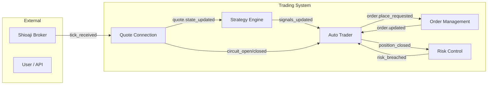
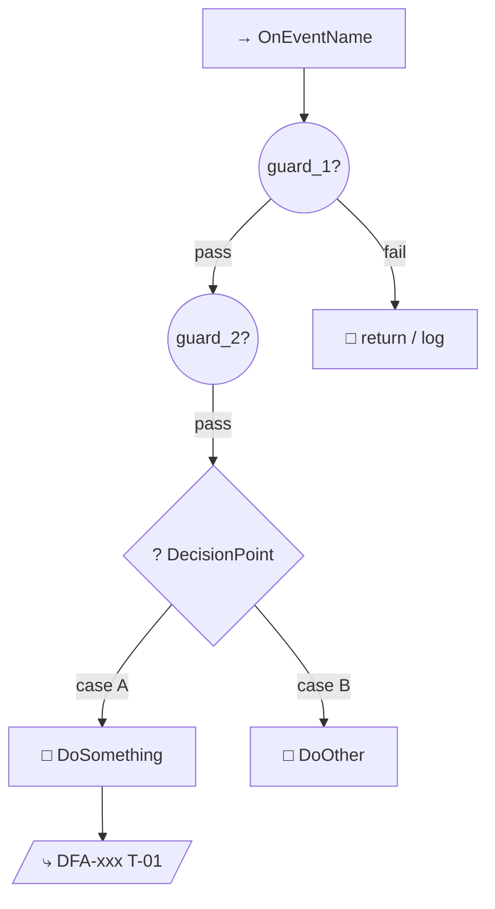
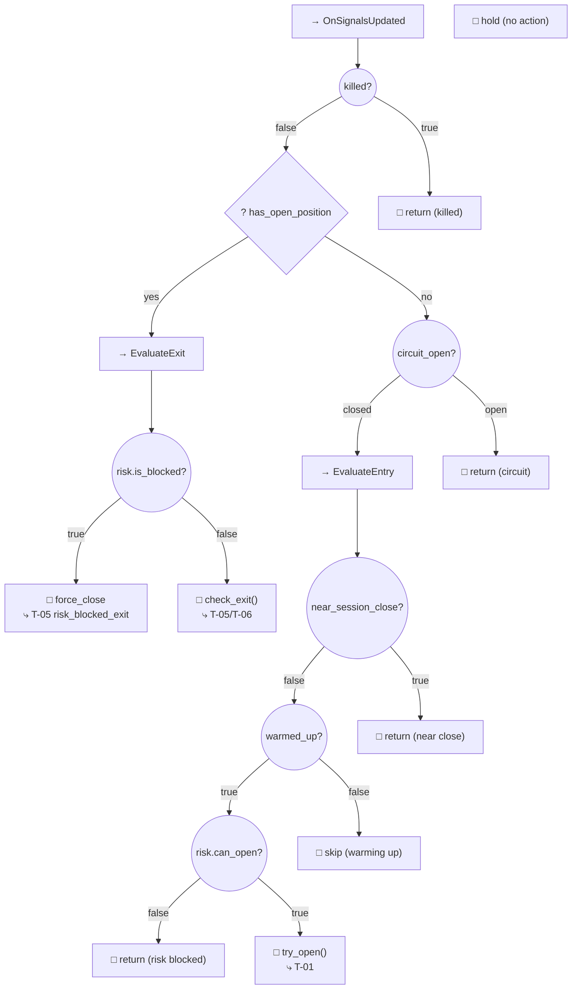
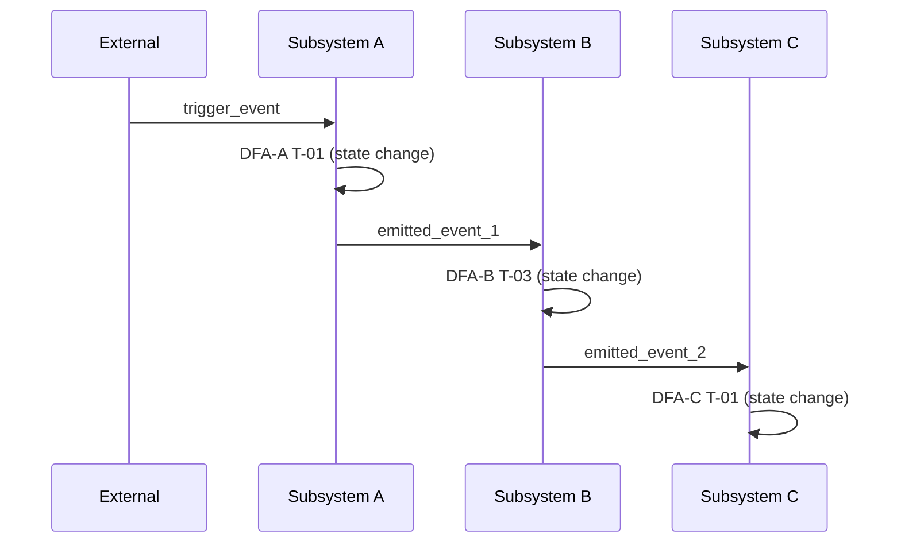

# DFA Behavior Tree Template

Template for `.planning/dfa/DFA-BTREE.md` — synthesizes all DFA state tables into a hierarchical behavior tree that shows how the system makes decisions at multiple zoom levels.

**Purpose:** Give developers a top-down view of system behavior. DFA state tables are per-subsystem and exhaustive; the behavior tree is cross-subsystem and hierarchical — it answers "what happens when event X arrives?" from the system's perspective, not one subsystem's perspective.

**Downstream consumers:**
- Developers — understand system behavior without reading every DFA
- Code reviewers — verify that decision priority matches intent
- Onboarding — new team members grasp the system in minutes

---

## Concepts

### Behavior Tree Node Types

| Node | Symbol | Mermaid Shape | Semantics |
|------|--------|---------------|-----------|
| **Sequence** | `→` | `["→ Name"]` rounded rect | Execute children left-to-right; stop on first failure |
| **Selector** | `?` | `{"? Name"}` diamond | Try children in priority order; stop on first success |
| **Condition** | `◇` | `(("condition"))` circle | Check a predicate — returns success/failure |
| **Action** | `□` | `["action"]` rect | Execute a side effect |
| **Reference** | `⤷` | `[/"⤷ DFA-xxx T-XX"/]` parallelogram | Link to a specific DFA transition |

### Zoom Levels

| Level | Shows | Use Case |
|-------|-------|----------|
| **L0 — System** | Subsystem boxes + event flow arrows | Architecture overview |
| **L1 — Capability** | Per-subsystem decision trees with major branches | Understanding behavior |
| **L2 — Detail** | Every guard, action, DFA transition reference | Code review / debugging |

---

## File Template

````markdown
# Behavior Tree: [System Name]

**Generated:** [date]
**Source DFAs:** [list of DFA files]
**Zoom Level:** [L0 / L1 / L2]

## L0 — System Overview

Shows subsystems as nodes, event flow as edges. No decision logic.



## L1 — Capability Trees

Each subsystem's decision logic as a behavior tree. Guards become Conditions, branches become Selectors, sequential steps become Sequences.

### [Subsystem: Event Handler Name]



### Derivation Rules

For each event handler in each DFA:

1. **Collect all transitions** where Event = this event (across all states)
2. **Extract guards** — these become Condition nodes
3. **Group by state** — different current states = Selector branches
4. **Order by gate priority** — system gates (killed, circuit) first, then state-specific
5. **Leaf nodes** = DFA transition references (T-XX, F-XX, S-XX)

## L2 — Detailed Trees

Same structure as L1 but every T-XX expanded to show:
- Full guard condition text
- All actions in sequence
- All emitted events
- Cross-references to consuming DFAs

### [Subsystem: Event Handler Name — Detail]



## Cross-Subsystem Event Flow

Shows how one event triggers a cascade across subsystems.

### Event Cascade: [trigger event]



## Metadata

### DFA Coverage

| DFA File | States | Events | Transitions | BT Nodes Generated |
|----------|--------|--------|-------------|-------------------|
| DFA-xxx | N | M | K | J |

### Event Flow Graph

| Event | Produced By | Consumed By |
|-------|------------|-------------|
| event.name | DFA-A (T-XX) | DFA-B |

````

---

## Derivation Algorithm

### Input
- All DFA files (from `.planning/dfa/` or `.planning/phases/`)
- Each DFA's `<boundary>`, `<states>`, `<events>`, `<transitions>`, `<forbidden>` sections

### Step 1: Build Event Flow Graph

From each DFA's `<boundary>`:
- **Produces** → outgoing edges
- **Depends on** → incoming edges

This gives the L0 diagram automatically.

### Step 2: Identify Entry Points

An "entry point" is an external event (source = outside the DFA set):
- User API calls
- Broker callbacks
- Timer expirations
- System bootstrap

Each entry point becomes a root node of an L1/L2 tree.

### Step 3: Build Per-Entry-Point Trees

For each entry point event:

1. **Find all DFAs that handle this event** (listed in their Events table)
2. **For the primary handler** (the DFA where this event triggers transitions):
   a. Collect all T-XX rows for this event
   b. Extract common gates (guards that appear in ALL rows for this event) → Sequence of Conditions at the top
   c. Extract state-dependent branches → Selector node
   d. For each branch, extract state-specific guards → nested Conditions
   e. Leaf = Action + emitted events
3. **For cascade handlers** (DFAs that consume emitted events):
   a. Add as child sequences after the emitting action
   b. Or document as cross-references (L1) / expand inline (L2)

### Step 4: Apply Gate Priority Order

System-level gates always appear first (top of tree):
1. `killed` check (DFA-trader-system)
2. `circuit_open` check (DFA-trader-system)
3. `warmup` check (DFA-trader-system)
4. Per-subsystem guards (DFA-trader-risk, DFA-trader-position)

This matches actual code execution order and ensures the BT reads like the code flows.

### Step 5: Generate Mermaid

- Use `flowchart TD` for L1/L2 trees (top-down decision flow)
- Use `flowchart LR` for L0 overview (left-right data flow)
- Use `sequenceDiagram` for event cascade visualization
- Use `subgraph` for hierarchical grouping
- Style nodes by type (fill colors for condition/action/reference)
