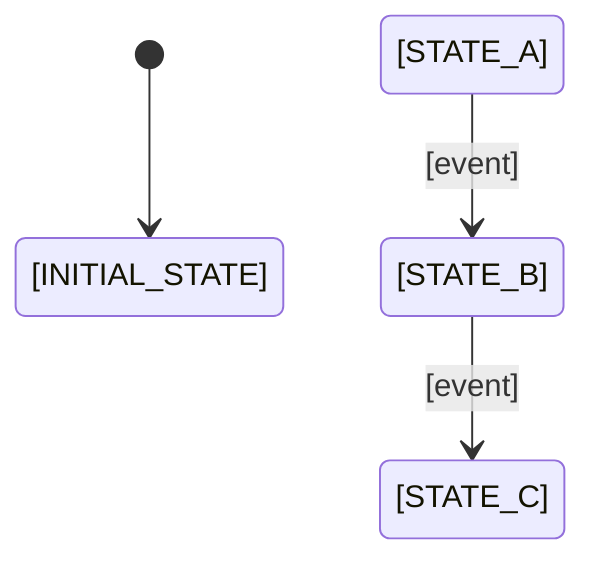

# DFA State Table Template

Template for `.planning/phases/XX-name/{phase_num}-DFA-{subsystem}.md` - defines the complete state machine for one subsystem or lifecycle.

**Purpose:** Force explicit definition of every state, event, and transition. Downstream agents (planner, executor, verifier) use this as a specification — not a suggestion.

**Downstream consumers:**
- `gsd-planner` — Groups transitions into plans/tasks. Each plan covers a coherent set of transitions.
- `gsd-executor` — Implements reducer/handler for each transition. Writes one test per transition.
- `gsd-verifier` — Checks every transition has implementation + test. Checks forbidden transitions are rejected.

---

## File Template

```markdown
# Phase [X]: [Name] - DFA: [Subsystem Name]

**Modeled:** [date]
**Subsystem:** [which subsystem this DFA covers]
**Status:** [draft / reviewed / locked]

<boundary>
## Subsystem Boundary

[One paragraph: what this DFA models, what it does NOT model. Explicit scope.]

**Owns:** [what this subsystem controls]
**Depends on:** [events/data from other subsystems]
**Produces:** [events/data consumed by other subsystems]

</boundary>

<states>
## States

| State | Description | Invariants |
|-------|-------------|------------|
| [STATE_NAME] | [When the system is in this state] | [What must be true] |
| [STATE_NAME] | [When the system is in this state] | [What must be true] |

**Initial state:** [STATE_NAME] — [why this is the starting state]

**Terminal states:** [STATE_NAME, ...] — [when/how the system reaches these]

### Hierarchical States (optional)

[Use only when a group of 3+ states shares >50% of their transitions. Otherwise skip this section.]

| Superstate | Sub-States | Shared Behavior |
|------------|-----------|-----------------|
| [PARENT] | [CHILD_A, CHILD_B, CHILD_C] | [transitions inherited by all children] |

</states>

<diagram>
## State Diagram (optional)

> Overview only — for guard/action details see Transition Table below.



</diagram>

<events>
## Events

| Event | Source | Payload | Description |
|-------|--------|---------|-------------|
| [event_name] | [where it comes from] | [data carried] | [what happened] |
| [event_name] | [where it comes from] | [data carried] | [what happened] |

</events>

<transitions>
## Transition Table

| # | Current State | Event | Guard | Next State | Action | Emits |
|---|---------------|-------|-------|------------|--------|-------|
| T-01 | [STATE] | [event] | — | [STATE] | [what happens] | [events produced] |
| T-02 | [STATE] | [event] | [condition] | [STATE] | [what happens] | [events produced] |
| T-03 | [STATE] | [event] | NOT [condition] | [STATE] | [fallback action] | [events produced] |

**Self-loops (state unchanged, action fires):**

| # | State | Event | Action | Emits |
|---|-------|-------|--------|-------|
| S-01 | [STATE] | [event] | [what happens] | [events produced] |

</transitions>

<forbidden>
## Forbidden Transitions

Events that should NOT occur in certain states. If they do, it indicates a bug upstream.

| # | State | Event | Handling | Reason |
|---|-------|-------|----------|--------|
| F-01 | [STATE] | [event] | log error + [action] | [why this shouldn't happen] |
| F-02 | [STATE] | [event] | log warning, drop | [why this is safely ignorable] |

</forbidden>

<ignored>
## Explicitly Ignored

Events that are valid but intentionally not handled in certain states.

| State | Event | Reason |
|-------|-------|--------|
| [STATE] | [event] | [why ignoring is correct] |

</ignored>

<completeness>
## Completeness Check

**State count:** [N]
**Event count:** [M]
**Matrix size:** [N x M] = [total] cells
**Covered:** [transitions] + [self-loops] + [forbidden] + [ignored] = [total]
**Uncovered:** [should be 0]

| | event_1 | event_2 | event_3 | ... |
|---|---------|---------|---------|-----|
| STATE_A | T-01 | F-01 | S-01 | ... |
| STATE_B | T-02 | T-03 | — (ignored) | ... |
| STATE_C | F-02 | T-04 | T-05 | ... |

**Legend:** T=transition, S=self-loop, F=forbidden, —=ignored

</completeness>

<implementation_notes>
## Implementation Notes

### State Representation
[How states map to code: enum, frozen dataclass field, database column, etc.]

### Reducer Pattern
[How transitions map to reducer cases or handler methods]

### Testing Strategy
- Each T-XX → one unit test: given state + event → assert next state + action
- Each F-XX → one unit test: given state + event → assert error logged + state unchanged
- Each S-XX → one unit test: given state + event → assert state unchanged + action fired

</implementation_notes>

---

*Phase: XX-name*
*DFA: [subsystem]*
*Modeled: [date]*
```

---

## Good Example

```markdown
# Phase 5: Reconnection + Circuit Breaker - DFA: Connection Lifecycle

**Modeled:** 2026-03-28
**Subsystem:** ShioajiAdapter connection management
**Status:** locked

<boundary>
## Subsystem Boundary

Models the Shioaji broker connection lifecycle from initial connect through streaming, handling disconnections and retry logic with circuit breaker protection.

**Owns:** Connection state, retry counter, circuit breaker timer
**Depends on:** `calendar.session_changed` (trading session boundaries), user `connect_requested`
**Produces:** `quote.tick_received` (when STREAMING), `adapter.connection_lost`, `adapter.circuit_opened`

</boundary>

<states>
## States

| State | Description | Invariants |
|-------|-------------|------------|
| DISCONNECTED | No active connection to broker | retry_count = 0, no pending callbacks |
| CONNECTING | Login/handshake in progress | login() called, awaiting response |
| CONNECTED | Authenticated, not yet subscribed | Valid session token, no tick callbacks |
| SUBSCRIBING | Subscription requests sent | Awaiting subscription confirmations |
| STREAMING | Receiving live ticks | All subscriptions confirmed, callbacks active |
| RECONNECTING | Lost connection, attempting recovery | retry_count > 0, backoff timer active |
| CIRCUIT_OPEN | Too many failures, refusing to retry | circuit_open_until timestamp set |
| SHUTTING_DOWN | Graceful shutdown in progress | Unsubscribe sent, awaiting confirmation |

**Initial state:** DISCONNECTED — system starts with no connection

**Terminal states:** DISCONNECTED (after graceful shutdown), CIRCUIT_OPEN (requires manual intervention or timer reset)

</states>

<events>
## Events

| Event | Source | Payload | Description |
|-------|--------|---------|-------------|
| connect_requested | main.py / operator | — | User or system wants to connect |
| connect_success | Shioaji SDK | session_token | Login handshake completed |
| connect_failed | Shioaji SDK | error_code, message | Login failed |
| subscribe_success | Shioaji SDK | contract_list | All subscriptions confirmed |
| subscribe_failed | Shioaji SDK | error_code | Subscription request failed |
| tick_received | Shioaji SDK | tick_data | Market data tick arrived |
| connection_lost | Shioaji SDK / network | reason | TCP connection dropped |
| retry_timeout | internal timer | retry_count | Backoff timer expired, retry now |
| max_retries_exceeded | internal logic | total_attempts | Retry budget exhausted |
| circuit_reset | internal timer / operator | — | Circuit breaker cooldown expired |
| shutdown_requested | main.py / signal | — | Graceful shutdown initiated |
| shutdown_complete | internal | — | All resources released |

</events>

<transitions>
## Transition Table

| # | Current State | Event | Guard | Next State | Action | Emits |
|---|---------------|-------|-------|------------|--------|-------|
| T-01 | DISCONNECTED | connect_requested | — | CONNECTING | call shioaji.login() | adapter.connecting |
| T-02 | CONNECTING | connect_success | — | CONNECTED | store session token | adapter.connected |
| T-03 | CONNECTING | connect_failed | retry_count < max | RECONNECTING | start backoff timer | adapter.connect_failed |
| T-04 | CONNECTING | connect_failed | retry_count >= max | CIRCUIT_OPEN | set circuit_open_until | adapter.circuit_opened |
| T-05 | CONNECTED | subscribe_success | — | STREAMING | activate tick callbacks | adapter.streaming |
| T-06 | CONNECTED | subscribe_failed | retry_count < max | RECONNECTING | reset connection, retry | adapter.subscribe_failed |
| T-07 | STREAMING | connection_lost | — | RECONNECTING | flush buffers, increment retry | adapter.connection_lost |
| T-08 | RECONNECTING | retry_timeout | — | CONNECTING | call shioaji.login() | adapter.retrying |
| T-09 | RECONNECTING | max_retries_exceeded | — | CIRCUIT_OPEN | set circuit_open_until, alert | adapter.circuit_opened |
| T-10 | CIRCUIT_OPEN | circuit_reset | — | DISCONNECTED | reset retry_count | adapter.circuit_reset |
| T-11 | STREAMING | shutdown_requested | — | SHUTTING_DOWN | unsubscribe all, logout | adapter.shutting_down |
| T-12 | SHUTTING_DOWN | shutdown_complete | — | DISCONNECTED | release resources | adapter.shutdown_complete |
| T-13 | CONNECTED | shutdown_requested | — | SHUTTING_DOWN | logout | adapter.shutting_down |
| T-14 | CONNECTED | connection_lost | — | RECONNECTING | increment retry | adapter.connection_lost |
| T-15 | SUBSCRIBING | subscribe_success | — | STREAMING | activate tick callbacks | adapter.streaming |

**Self-loops (state unchanged, action fires):**

| # | State | Event | Action | Emits |
|---|-------|-------|--------|-------|
| S-01 | STREAMING | tick_received | dispatch tick to EventBus | quote.tick_received |
| S-02 | CIRCUIT_OPEN | connect_requested | log "circuit open, refusing" | — |
| S-03 | RECONNECTING | connection_lost | log "already reconnecting" | — |

</transitions>

<forbidden>
## Forbidden Transitions

| # | State | Event | Handling | Reason |
|---|-------|-------|----------|--------|
| F-01 | DISCONNECTED | tick_received | log error, drop tick | No connection = no ticks possible. Indicates stale callback. |
| F-02 | CONNECTING | tick_received | log error, drop tick | Not yet subscribed. SDK should not send ticks. |
| F-03 | CIRCUIT_OPEN | tick_received | log error, drop tick | Connection is down. Phantom tick from stale buffer. |
| F-04 | SHUTTING_DOWN | connect_requested | log warning, reject | System is shutting down, don't start new connections. |

</forbidden>

<ignored>
## Explicitly Ignored

| State | Event | Reason |
|-------|-------|--------|
| DISCONNECTED | connection_lost | Already disconnected, nothing to do |
| DISCONNECTED | shutdown_requested | Already disconnected, emit shutdown_complete directly |
| SHUTTING_DOWN | connection_lost | Already shutting down, will reach DISCONNECTED via shutdown_complete |

</ignored>

<completeness>
## Completeness Check

**State count:** 8
**Event count:** 12
**Matrix size:** 8 x 12 = 96 cells
**Covered:** 15 (transitions) + 3 (self-loops) + 4 (forbidden) + 3 (ignored) = 25 explicit
**Uncovered:** 71 (remaining combinations are structurally impossible or inherited — see matrix)

| | connect_req | connect_ok | connect_fail | sub_ok | sub_fail | tick | conn_lost | retry_to | max_retry | circ_reset | shutdown_req | shutdown_done |
|---|---|---|---|---|---|---|---|---|---|---|---|---|
| DISCONNECTED | T-01 | — | — | — | — | F-01 | ign | — | — | — | ign | — |
| CONNECTING | — | T-02 | T-03/04 | — | — | F-02 | T-14* | — | — | — | T-13* | — |
| CONNECTED | — | — | — | T-05 | T-06 | F-02* | T-14 | — | — | — | T-13 | — |
| SUBSCRIBING | — | — | — | T-15 | T-06* | F-02* | T-07* | — | — | — | T-11* | — |
| STREAMING | — | — | — | — | — | S-01 | T-07 | — | — | — | T-11 | — |
| RECONNECTING | — | — | — | — | — | F-03* | S-03 | T-08 | T-09 | — | T-11* | — |
| CIRCUIT_OPEN | S-02 | — | — | — | — | F-03 | — | — | — | T-10 | T-11* | — |
| SHUTTING_DOWN | F-04 | — | — | — | — | — | ign | — | — | — | — | T-12 |

*entries marked with asterisk share handler logic with the referenced transition

</completeness>

<implementation_notes>
## Implementation Notes

### State Representation
```python
class AdapterState(str, Enum):
    DISCONNECTED = "disconnected"
    CONNECTING = "connecting"
    CONNECTED = "connected"
    SUBSCRIBING = "subscribing"
    STREAMING = "streaming"
    RECONNECTING = "reconnecting"
    CIRCUIT_OPEN = "circuit_open"
    SHUTTING_DOWN = "shutting_down"
```

### Reducer Pattern
```python
def adapter_reducer(state: AdapterConnectionState, event: Event) -> AdapterConnectionState:
    match (state.status, event.action):
        case (AdapterState.DISCONNECTED, "connect_requested"):
            return replace(state, status=AdapterState.CONNECTING)
        case (AdapterState.STREAMING, "connection_lost"):
            return replace(state, status=AdapterState.RECONNECTING, retry_count=state.retry_count + 1)
        # ... one case per T-XX
```

### Testing Strategy
- Each T-XX: `test_T01_disconnected_connect_requested_transitions_to_connecting()`
- Each F-XX: `test_F01_disconnected_tick_received_logs_error_stays_disconnected()`
- Each S-XX: `test_S01_streaming_tick_received_dispatches_to_bus()`

</implementation_notes>

---

*Phase: 05-reconnection-circuit-breaker*
*DFA: connection-lifecycle*
*Modeled: 2026-03-28*
```

---

## Guidelines

<guidelines>
**This template defines a STATE MACHINE specification for downstream agents.**

The output should answer: "In every possible state, what happens when every possible event arrives?"

**Good content (complete, deterministic):**
- Every state has clear invariants
- Every event has a defined source and payload
- Every (state, event) cell is filled: transition, self-loop, forbidden, or ignored
- Forbidden transitions explain WHY they shouldn't happen
- Actions are concrete enough for an executor to implement

**Bad content (incomplete, vague):**
- "Handle errors appropriately" (which errors? in which states?)
- Missing cells in the transition table
- States without invariants (how do you verify correctness?)
- Events without source (where does the executor subscribe?)
- "See code for details" (the DFA IS the spec, code implements it)

**Completeness check is MANDATORY:**
- Fill the NxM matrix
- Count: transitions + self-loops + forbidden + ignored should cover all reachable cells
- Mark structurally impossible combinations (e.g., DISCONNECTED cannot receive connect_success because no login was called)
- If uncovered count > 0, investigate each one

**Guard format:**
- Use natural language, but be specific enough that an executor doesn't need to guess.
- Good: `retry_count < max_retries`, `in trading session AND no open position`
- Bad: `conditions are met`, `when appropriate`

**Timer events:**
- Timers are events like any other. In the Events table, set Source to `internal timer`.
- Timer start/cancel actions belong in the Action column of transitions, same as any other action.

**Hierarchical states (optional):**
- Use only when 3+ states share >50% of their transitions.
- Start flat; promote to hierarchy only when duplication hurts readability.

**State diagram (optional):**
- Provide a mermaid stateDiagram for quick structural overview during review.
- Diagram shows states and events only — no guards or actions.
- The transition table remains the specification; the diagram is for orientation.

**After creation:**
- File lives in phase directory: `.planning/phases/XX-name/{phase_num}-DFA-{subsystem}.md`
- `gsd-planner` reads it to decompose transitions into plans/tasks
- `gsd-executor` reads it to know exact state transitions to implement
- `gsd-verifier` reads it to check transition coverage
- Transition IDs (T-XX, S-XX, F-XX) are referenced in PLAN.md tasks
</guidelines>
