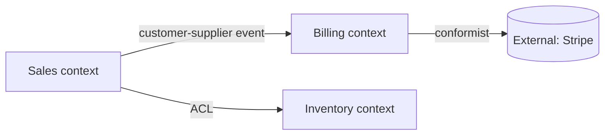

<purpose>
Build the strategic DDD foundation for a project: ubiquitous language (per bounded context) + bounded-context map. Output is consumed by /gsd-mini-aggregate, /gsd-mini-event-storm, /gsd-mini-storage, and /gsd-dfa-model.
</purpose>

<required_reading>
Read all files referenced by the invoking prompt's execution_context before starting.
</required_reading>

<process>

<step name="validate_inputs">
**Check prerequisites.**

```bash
PROJECT_FILE=".planning/PROJECT.md"
REQUIREMENTS_FILE=".planning/REQUIREMENTS.md"

# Both required — bounded contexts come from understanding the system's purpose and scope
[ -f "$PROJECT_FILE" ] || { echo "Missing $PROJECT_FILE — run /gsd-new-project first"; exit 1; }
[ -f "$REQUIREMENTS_FILE" ] || { echo "Missing $REQUIREMENTS_FILE — run /gsd-new-project first"; exit 1; }

# Detect brownfield (codebase/ exists from /gsd-map-codebase)
HAS_CODEBASE_MAP=0
[ -f ".planning/codebase/STRUCTURE.md" ] && HAS_CODEBASE_MAP=1

# Existing artifacts — may be regenerating
DDD_DIR=".planning/ddd"
mkdir -p "$DDD_DIR"
EXISTING_CONTEXT_MAP="$DDD_DIR/CONTEXT-MAP.md"
EXISTING_UL="$DDD_DIR/UBIQUITOUS-LANGUAGE.md"
```

If `--from-requirements` is in `$ARGUMENTS`, treat any existing files as stale and proceed to fresh derivation. Otherwise, if either exists, ask whether to regenerate (preserves history if user wants it).
</step>

<step name="parse_flags">
**Parse mode.**

```
AUTO_MODE=false
FROM_REQUIREMENTS=false
TEXT_MODE=false
[[ "$ARGUMENTS" =~ --auto ]] && AUTO_MODE=true
[[ "$ARGUMENTS" =~ --from-requirements ]] && FROM_REQUIREMENTS=true
[[ "$ARGUMENTS" =~ --text ]] && TEXT_MODE=true
```

**Text mode (`workflow.text_mode: true` in config or `--text` flag):** Set `TEXT_MODE=true` if `--text` is present in `$ARGUMENTS` OR `text_mode` from init JSON is `true`. When TEXT_MODE is active, replace every `AskUserQuestion` call below with a plain-text numbered list and ask the user to type their choice number. This is required for non-Claude runtimes (OpenAI Codex, Gemini CLI, etc.) where `AskUserQuestion` is not available.

In `--auto` mode, skip the AskUserQuestion loops in steps 4 and 5; AI picks the most likely contexts and integration patterns from inputs.
</step>

<step name="extract_signals">
**Read PROJECT.md and REQUIREMENTS.md to extract context signals.**

From PROJECT.md, identify:
- Vision statement (one-sentence purpose)
- Target users (actor types — these often map to bounded contexts)
- Core capabilities (verb-noun pairs — these often span contexts)

From REQUIREMENTS.md, identify:
- Requirement clusters by area / module / feature group — each cluster is a bounded-context candidate
- Cross-cutting concerns (auth, billing, audit log) — often warrant their own contexts
- External integrations (third-party APIs, databases, message brokers) — define integration boundaries

If brownfield (`HAS_CODEBASE_MAP=1`), also read `.planning/codebase/STRUCTURE.md` and `ARCHITECTURE.md`. Existing top-level directories often correspond to existing (or aspiring) bounded contexts.
</step>

<step name="propose_contexts">
**AI proposes initial bounded contexts.**

Based on signals extracted in step 3, draft a candidate list. Aim for 3–7 contexts for a typical project (more is suspicious; fewer probably hides one).

For each candidate, draft:
- **Name** (in domain language, not infrastructure language — `Sales` not `OrderService`)
- **Purpose** (one sentence)
- **Owner** (placeholder — user will refine)
- **Core domain terms** (3–5 nouns and verbs central to this context)
- **External touchpoints** (other contexts and external systems it talks to)

Show the candidate list to the user. In `--auto` mode, accept the AI's draft as-is. Otherwise, use AskUserQuestion to walk through:

```
Proposed bounded contexts (initial draft):
1. <Name 1> — <purpose>
2. <Name 2> — <purpose>
...

For each, we'll confirm/rename/merge/split. After you approve the list,
we'll define integration patterns between them.
```

Ask context-by-context (or batch in groups of 3 with `--batch` if respected by harness):
- "Keep / rename / merge with another / split / drop?"
- "Who owns this context (team / role)?"
- "Any domain terms I missed?"

Iterate until the user signals "list is good".
</step>

<step name="define_integrations">
**For each pair of contexts that interact, capture the integration pattern.**

Standard DDD integration patterns:
- **Anti-corruption layer (ACL)** — downstream context translates upstream model into its own; protects from upstream churn
- **Shared kernel** — small shared model used by both; tightly coupled change cycle
- **Customer-supplier** — supplier prioritizes customer's needs; planned change cycle
- **Open-host service (OHS)** — supplier publishes a stable interface used by many
- **Conformist** — downstream accepts upstream model as-is (can't influence it)
- **Partnership** — both contexts succeed or fail together; ad-hoc collaboration

For each pair, ask (or in `--auto`, infer):
- Which direction is the dependency? (or is it bidirectional?)
- Which pattern fits? (default: ACL if downstream context has its own model)
- Synchronous or asynchronous? (REST / event)

Build a list of edges:
```
{ from: "Sales", to: "Billing", pattern: "customer-supplier", direction: "Sales → Billing", sync: "async (event)" }
```
</step>

<step name="build_ubiquitous_language">
**Compose UBIQUITOUS-LANGUAGE.md from the per-context core terms collected in step 4.**

Use the `ddd-ubiquitous-language.md` template structure. For every term:
- Definition (specific to this context)
- Aliases / synonyms commonly used informally (mark as discouraged if they leak from another context's language)
- Examples or counter-examples
- Cross-context note: if the same word appears in another context with a different meaning, link both entries and explain the divergence

Sort by context, then alphabetically within context.
</step>

<step name="build_context_map">
**Compose CONTEXT-MAP.md.**

Use the `ddd-context-map.md` template. Include:
- One section per bounded context (Name, Purpose, Owner, Core terms, External touchpoints)
- Integration patterns table (one row per edge from step 5)
- Mermaid context map diagram:



Annotate edges with the integration pattern label.
</step>

<step name="write_artifacts">
**Write both files atomically.**

```bash
# Write UBIQUITOUS-LANGUAGE.md
# Write CONTEXT-MAP.md
```

Cross-link the two files in their respective headers (UBIQUITOUS-LANGUAGE.md links to CONTEXT-MAP.md and vice versa).
</step>

<step name="verify">
**Verify completeness before reporting success.**

Run these checks (informational; don't block):
- Every context in CONTEXT-MAP.md appears in UBIQUITOUS-LANGUAGE.md
- Every term in UBIQUITOUS-LANGUAGE.md is scoped to at least one context
- Mermaid diagram parses (basic syntax check)
- No edge in the integration table has an unrecognized pattern name
- If a term appears in 2+ contexts, both entries reference each other

Report:
```
gsd-mini-domain ► DONE
  Bounded contexts: N
  Domain terms: M
  Integration edges: K
  Files: .planning/ddd/UBIQUITOUS-LANGUAGE.md
         .planning/ddd/CONTEXT-MAP.md

  Next: /gsd-mini-aggregate <aggregate-name> --context <one of the contexts above>
```
</step>

</process>

<success_criteria>
- [ ] `.planning/ddd/UBIQUITOUS-LANGUAGE.md` written with terms scoped per context
- [ ] `.planning/ddd/CONTEXT-MAP.md` written with contexts, integrations, Mermaid diagram
- [ ] Every term scoped to ≥1 context
- [ ] Every context appears in both files
- [ ] Cross-context term collisions explicitly captured
- [ ] Integration patterns drawn from the standard DDD set (ACL / shared kernel / customer-supplier / OHS / conformist / partnership)
- [ ] Output usable by /gsd-mini-aggregate, /gsd-mini-event-storm, /gsd-mini-storage, /gsd-dfa-model
</success_criteria>
